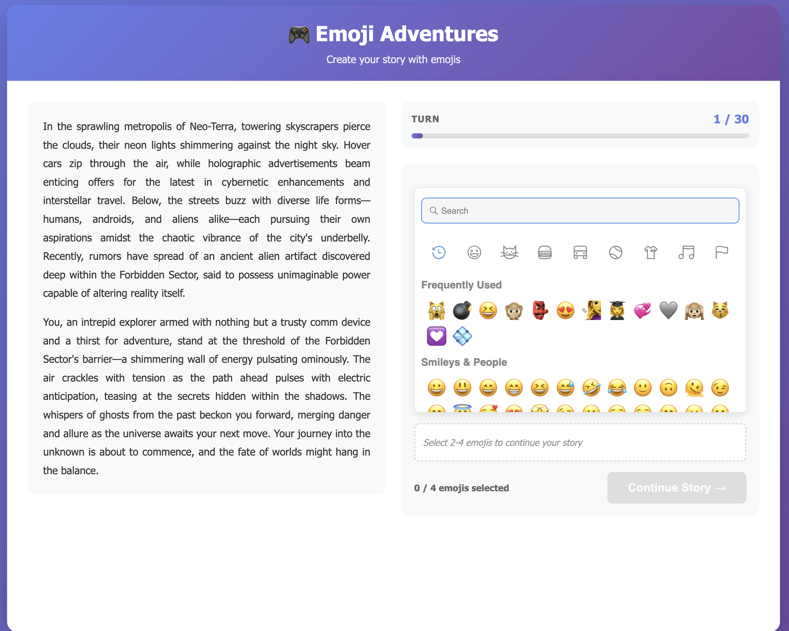

# 🎮 Emoji Adventures

An AI-powered storytelling game where you create branching narratives using emoji combinations. Built with GPT-4o-mini and React.



## 🌟 Features

- **5 Genre Options**: Fantasy, Sci-Fi, Mystery, Horror, and Adventure
- **AI-Powered Storytelling**: GPT-4o-mini interprets your emoji choices and crafts unique narratives
- **Branching Narratives**: Your emoji combinations lead to different story paths
- **Creative Gameplay**: Same emoji sequence creates different stories each playthrough
- **Dynamic Endings**: Stories can end early with failure states or reach natural conclusions
- **Turn-Based System**: 20-30 turn adventures with adaptive pacing

## 🎯 How to Play

1. **Choose a Genre**: Select from Fantasy, Sci-Fi, Mystery, Horror, or Adventure
2. **Read the Story**: AI generates an engaging opening scenario
3. **Pick 2-4 Emojis**: Select emojis that represent your character's action
4. **Watch the Story Unfold**: AI interprets your choices and continues the narrative
5. **Reach the Conclusion**: Stories can end in victory, defeat, or natural conclusion

## 🛠️ Tech Stack

### Backend
- **FastAPI**: High-performance async Python web framework
- **OpenAI GPT-4o-mini**: Advanced AI for story generation via Responses API
- **Pydantic**: Data validation and settings management

### Frontend
- **React 18**: Modern UI library with 2-column responsive layout
- **Vite**: Fast build tool with proxy configuration
- **emoji-picker-react**: Always-visible emoji picker component
- **Axios**: HTTP client for API calls

## 📦 Installation

### Prerequisites
- Docker and Docker Compose
- OpenAI API key

### Quick Start with Docker (Recommended)

1. **Setup environment**
```bash
cd emoji-adventures
cp .env.example .env
# Edit .env and add your OPENAI_API_KEY
```

2. **Start the game**
```bash
docker-compose up --build
```

That's it! Both backend and frontend will start automatically.
- Frontend: http://localhost:3000
- Backend API: http://localhost:8000

3. **Stop the game**
```bash
docker-compose down
```

### Manual Setup (For Development)

If you want to run services separately for development:

**Prerequisites**: Python 3.11+, Node.js 18+

1. **Setup Backend**
```bash
cd backend
python -m venv venv
source venv/bin/activate  # On Windows: venv\Scripts\activate
pip install -r requirements.txt
```

2. **Setup Frontend**
```bash
cd frontend
npm install
```

3. **Run Backend**
```bash
cd backend
source venv/bin/activate
python -m uvicorn app.main:app --reload
```

4. **Run Frontend** (new terminal)
```bash
cd frontend
npm run dev
```

## 🎮 Game Mechanics

### Emoji Interpretation
- **Always Visible Picker**: Emoji picker stays open for quick selection
- **Context Matters**: Same emoji means different things in different situations
- **Order Matters**: 🔥⚔️ (fire then sword) vs ⚔️🔥 (sword then fire) can have different meanings
- **Combinations**: 2-4 emojis create complex actions (🏃💨🌲 = running quickly into forest)

### Story Progression
- **Turns 1-10**: Setup, exploration, character establishment
- **Turns 11-20**: Rising action, challenges, complications
- **Turns 21-30**: Climax and resolution

### Failure States & Game Over
- Character death from dangerous choices
- Impossible situations with no recovery
- Story contradictions that can't continue
- **Improved UX**: Read final story before manually restarting

## 🏗️ Project Structure

```
emoji-adventures/
├── backend/
│   ├── app/
│   │   ├── __init__.py
│   │   ├── main.py              # FastAPI app & routes
│   │   ├── models.py            # Pydantic models
│   │   ├── story_engine.py      # AI story generation with Responses API
│   │   └── prompts.py           # Optimized prompts for concise stories
│   ├── requirements.txt
│   └── Dockerfile
├── frontend/
│   ├── src/
│   │   ├── components/
│   │   │   ├── GenreSelector.jsx
│   │   │   ├── GamePlay.jsx
│   │   │   ├── EmojiInput.jsx
│   │   │   ├── StoryDisplay.jsx
│   │   │   ├── TurnCounter.jsx
│   │   │   └── GameOver.jsx
│   │   ├── App.jsx
│   │   └── main.jsx
│   ├── package.json
│   └── Dockerfile
├── docker-compose.yml
└── README.md
```

## 🔧 API Endpoints

### `POST /api/game/start`
Start a new game session
```json
Request: { "genre": "fantasy" }
Response: { "session_id": "...", "story": "...", "turn": 1, "game_over": false }
```

### `POST /api/game/continue`
Continue the game with emoji input
```json
Request: { "session_id": "...", "emojis": ["🔥", "⚔️", "🐉"] }
Response: { "story": "...", "turn": 5, "game_over": false, "game_over_reason": null }
```

### `DELETE /api/game/end/{session_id}`
End a game session

## 🎨 Customization

### Add New Genres
Edit `backend/app/prompts.py` and `frontend/src/components/GenreSelector.jsx`

### Adjust Story Length
Change `MAX_TURNS` in `backend/app/main.py`

### Modify Story Length
Adjust paragraph count and sentence limits in `backend/app/prompts.py`

## 🐛 Troubleshooting

**Backend won't start**
- Verify OpenAI API key is set in `.env`
- Check Python version (3.11+ required)
- Ensure all dependencies are installed

**Frontend can't connect to backend**
- Verify backend is running on port 8000
- Check CORS settings in `backend/app/main.py`

**Stories seem repetitive**
- Try different emoji combinations
- Select a different genre
- Each playthrough generates unique narratives

## 📝 License

MIT License - feel free to use and modify for your projects!

## 🤝 Contributing

Contributions welcome! Ideas for improvement:
- Save/load game sessions
- Multiple players taking turns
- Story history viewer
- Achievement system
- More genres

## 🎯 Key Features

- **2-Column Layout**: Story on left, controls on right - no scrolling needed
- **Responsive Design**: Adapts to different screen sizes
- **Concise Stories**: Optimized for quick, engaging gameplay
- **Manual Restart**: Read the ending before starting a new adventure

## 🙏 Acknowledgments

- OpenAI for GPT-4o-mini and Responses API
- emoji-picker-react for the emoji selector
- FastAPI and React communities

---

**Enjoy your emoji-powered adventures!** 🎭🚀🏰🔍👻
